  

 

### 🚀 [Live Portfolio Site →](https://wandana-vasho.vercel.app/)

 

## ⚡ The 10-second version

My most-recent capstone: a baseline model scored **0.994** — a number
that should have shipped as a win. Instead of reporting it, I audited
*why* it was that clean, found the baseline and the label were built
from the same formula, named the flaw, and published the honest result
instead. That habit — checking the number before trusting it — is the
throughline across everything below.

> **What I'm looking for:** Backend / AI engineering roles where someone
> questioning a number before it ships is a feature, not friction.

 

## 🧠 About

Software Engineering student (Sindh Agriculture University) and Backend
AI Engineering intern at FlyRank. Sindh Talent Hunt Program scholarship
recipient, selected from 5,000+ applicants. Fluent in English, Sindhi,
and Urdu.

 

## 🛠️ Tech Stack

 

## 📊 Git Log / Stats

 

## 🚀 Featured Projects

<table>
<tr>
<td width="50%" valign="top">

### 🔐 [Embeddable Widget & Lead-Capture Platform](https://github.com/wandana-vasho/flyrank-capstone-widget-platform)
Multi-tenant SaaS backend capstone: hardened public API (CORS, rate
limiting, honeypot spam filter), a real geo-provider fallback chain,
safe non-blocking side effects.

`FastAPI` `SQLAlchemy` `Postgres` · **18/18 tests passing**

</td>
<td width="50%" valign="top">

### 🧩 [AI Decision Flow](https://github.com/wandana-vasho/ai-decision-flow)
Visual AI workflow builder: React Flow canvas for designing decision
trees, Inngest running execution as real durable background steps —
each node is an AI call that returns YES/NO and branches the graph
live.

`Next.js` `React Flow` `Inngest` `OpenAI SDK`

</td>
</tr>
<tr>
<td width="50%" valign="top">

### ⏱️ [Your First Background Job](https://github.com/wandana-vasho/background-job)
The production pattern for anything slow: accept-fast /
background-worker / status-endpoint, with real idempotency and
exponential backoff. Caught and fixed a live race-condition bug during
testing.

`FastAPI` `SQLAlchemy` · **8/8 tests passing**

</td>
<td width="50%" valign="top">

### 🔑 [Auth API](https://github.com/wandana-vasho/auth-api)
JWT auth tested against missing, invalid, *and tampered* tokens — not
just the happy path.

`FastAPI` `Supabase`

</td>
</tr>
<tr>
<td width="50%" valign="top">

### 🤖 [The Polite Scraper](https://github.com/wandana-vasho/Polite-scraper)
robots.txt-respecting scraper — rate limited, honest User-Agent, clean
fetch → parse → extract → clean → structure pipeline.

`Python` `BeautifulSoup`

</td>
<td width="50%" valign="top">

### 🎯 SmartOps
Enterprise multi-agent RAG platform with adversarial-protected SQL
guardrails.

`LlamaIndex` `LangGraph` `Qdrant` `Ragas`

</td>
</tr>
</table>

<b>More projects (ML / research)</b>

 

| Project | What it does |
|---|---|
| **FraudShield AI** | Weighted ensemble fraud detection — F1 0.98, ROC-AUC 0.9992 |
| **FinInsight Pro** | SaaS-level AI financial analytics platform |
| **VisionForge AI** | Gender and age estimation demo |
| **NexusAI** | AI resume analyzer |

 

## 📍 Currently

🔭 Backend AI Engineering Intern @ FlyRank — Portkey gateway
integration, structured output validation, adversarial-protected SQL
guardrails.

📚 FlyRank's AI Fluency track, alongside the Backend track.

🎨 Portfolio site is live — Next.js, deployed on Vercel, full case
studies with real numbers. [wandana-vasho.vercel.app](https://wandana-vasho.vercel.app/)

 

*"I catch what looks right but isn't."*

